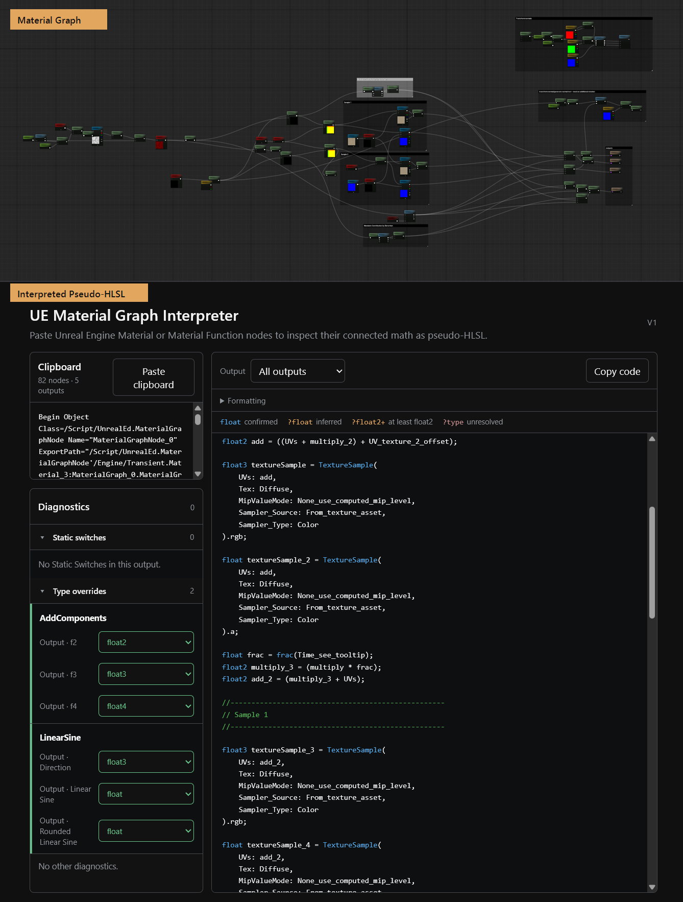
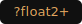

# UE5 Material Graph Interpreter

**Turn copied Unreal Engine Material Graph nodes into concise, readable pseudo-HLSL.**

UE5 Material Graph Interpreter is a free browser-based tool for understanding, debugging, and sharing Unreal Engine 5 material logic. Copy nodes or an entire Material Function directly from the Unreal Material Editor, paste the clipboard text, and get code that describes the connected math without Unreal's generated shader boilerplate.

Use the result to review unfamiliar graphs, spot mathematical mistakes, discuss shader logic with another technical artist, or give ChatGPT and other AI assistants a readable representation of your material code.

# [Open the live interpreter](https://vitalyvishnev.github.io/UE5MaterialGraphInterpreter/)

No installation, upload, account, or Unreal plugin is required. Clipboard analysis runs locally in your browser.

<!-- README screenshot slot:
Place the paired hero images under docs/images/ when supplied.
Recommended layout: Unreal Material Graph on the left, generated pseudo-HLSL on the right.
Use descriptive filenames and alt text containing the graph/function name.
-->

## Why this exists

Unreal Material Graphs are convenient to build but difficult to communicate outside the editor:

- generated Unreal HLSL is large and dominated by engine implementation details;
- screenshots show layout, but are awkward to search, quote, compare, or send to an AI assistant;
- copied Unreal clipboard text preserves the graph, but is not designed for humans to read;
- large Material Functions can hide simple mathematical mistakes inside many nodes and reroutes.

This interpreter turns the copied graph into a compact semantic explanation. It preserves uncertainty instead of pretending to be the Unreal shader compiler.

## How it works

1. Select Material nodes or a complete Material Function in Unreal Engine.
2. Press `Ctrl+C`.
3. Open the [interpreter](https://vitalyvishnev.github.io/UE5MaterialGraphInterpreter/) and press **Paste clipboard** or `Ctrl+V`.
4. Read, copy, or share the generated pseudo-HLSL.

The output updates immediately when you select another Function Output, change a relevant Static Switch, confirm an unresolved type, or adjust formatting.

## From graph math to readable code

The goal is not byte-for-byte Unreal HLSL. The goal is a stable, compact description of the graph's logic.

## What it understands

V1 supports the graph structures and Material Expression families most useful for local shader-math analysis:

- Math expressions, constants, vectors, masks, swizzles, derivatives, and coordinate transforms;
- Function Inputs, Function Outputs, multiple outputs, and **All outputs** bundles;
- parameters, engine-provided input data, Material Attributes, and dynamic attribute pins;
- texture, virtual-texture, and volume-texture sampling, including mip level, bias, and derivative modes;
- Custom HLSL nodes, with optional source expansion;
- Material Function calls with readable names and editable unresolved output types;
- Named Reroutes, ordinary reroutes, graph comment regions, and output boundaries;
- Static Switch specialization with interactive `True` / `False` overrides;
- Substrate, atmosphere, distance-field, volumetric, and render-path expressions;
- scalar Noise and Vector Noise.

The registry is based on real Unreal clipboard captures and primary Unreal documentation. The current regression corpus spans Unreal Engine 4.22 through Unreal Engine 5.8, with the expression registry focused on UE5.8.

## Honest type inference

Unreal clipboard data does not always contain a final output type, especially for external Material Functions. Generated code shows how certain each type is:

| Notation | Meaning |
| --- | --- |
|  | Confirmed by explicit graph data or deterministic node semantics |
|  | Inferred from the surrounding graph |
|  | At least this many channels are required, but the exact width is unknown |
|  | The copied graph does not contain enough evidence |

Unresolved external function outputs and Custom HLSL inputs appear in **Type overrides**. If you know the type from Unreal, select it there and the code is regenerated immediately.

## How variable names are chosen

The interpreter prefers graph-author intent over temporary Unreal node IDs. When several names are available, the effective priority is:

1. Named Reroute that deliberately renames the value;
2. Function Input, Function Output, parameter, or a short label-like node `Description` / Node Comment;
3. a Comment Region containing exactly one surviving declaration;
4. an external function's named output pin;
5. a semantic operation or expression name such as `normalize`, `worldPosition`, or `vectorNoise`;
6. a numeric suffix such as `_2` only when two declarations would otherwise collide.

One-use expressions are normally inlined. Named values, shared results, complex operations, parameters, and opaque external calls remain as declarations so the output stays readable without reproducing every graph node.

## Readability controls

Formatting options can:

- preserve large graph comments as code sections;
- expand connected Custom HLSL nodes;
- wrap long calls and nested formulas;
- add spacing around complex operations;
- simplify constant arithmetic and neutral operations such as `x * 1` or `x + 0`;
- render multiple Function Outputs as a readable bundle or a stricter HLSL-like structure.

Exact graph structure remains available by disabling optional simplification.

## Privacy

Analysis is synchronous and local to the browser. The application has no backend, account system, telemetry, or graph-upload service. Your Unreal clipboard text is not sent to this project or stored by it.

## Current limitations

- Pseudo-HLSL explains semantics; it is not guaranteed to compile as standalone Unreal shader code.
- External Material Functions cannot be expanded when their internal graphs were not copied. Their calls remain visible and their output types may need confirmation.
- A partial selection cannot recover nodes, Named Reroute declarations, or dependencies that were not copied.
- Static Switch controls describe one selected shader specialization, not every possible material-instance and platform permutation.
- Unsupported or ambiguous expressions remain explicit in Diagnostics instead of being guessed.
- The tool does not currently reconstruct or host a visual Material Graph.

## License and attribution

Released under the [MIT License](LICENSE).

Unreal Engine is a trademark or registered trademark of Epic Games, Inc. This independent project is not affiliated with, endorsed by, or sponsored by Epic Games.
